# Elevator System (LLD)

A highly robust, fully concurrent Low-Level Design (LLD) of an Elevator System implemented in Java.

This project simulates a real-world elevator environment using advanced concurrency models (Actor Model), design
patterns, and asynchronous event-driven architecture. It dynamically handles passenger requests, weight limits, and
emergency interruptions without race conditions or thread blocking.

## 🚀 Key Features

* **True Concurrency (Actor Model):** Each elevator operates on its own dedicated background thread (its "Motor"). A
  central controller queues requests and drops them into the elevators' thread-safe `inboxes`, completely eliminating "
  runaway elevator" race conditions.
* **Dynamic Dispatch Strategies:** Supports hot-swapping routing algorithms at runtime.
    * `NearestCarStrategy`: Dispatches the closest available elevator.
    * `SCANStrategy`: The classic elevator algorithm that sweeps up and down, picking up passengers mid-transit if they
      are heading in the same direction.
* **Physical Constraints:** * **Weight Sensors:** Elevators refuse requests if the physical capacity limit (e.g., 800kg)
  is reached, and trigger observer alarms.
    * **Maintenance & Emergencies:** Supports planned downtime (`MAINTENANCE`) and instant, thread-safe emergency
      halting (`NOT_AVAILABLE`).
* **Event-Driven Telemetry:** Uses the Observer pattern to broadcast door movements, floor arrivals, alarms, and
  overload warnings to independent display, logging, and sound systems.

---

## 🏗️ Architecture & Class Diagram

The system is built on **SOLID principles**, heavily utilizing **Composition** over inheritance.

*Diagram Key:*

* `<|--` Inheritance (IS-A)
* `..|>` Realization / Implements
* `*--` Composition (Strict Ownership / Part-of)
* `o--` Aggregation (Shared Lifecycle / Has-a)
* `-->` Directed Association (Knows-about / Uses)

```mermaid
classDiagram
    %% ================= Interfaces =================
    class IElevator {
        <<interface>>
        +getElevatorId() int
        +getCurrentFloor() int
        +setCurrentFloor(int)
        +getDirection() Direction
        +setDirection(Direction)
        +getElevatorStatus() ElevatorStatus
        +setElevatorStatus(ElevatorStatus)
        +getDoor() Door
        +getWeightSensor() WeightSensor
    }

    class Panel {
        <<interface>>
        +pressButton(Button)
    }

    class ElevatorPanel {
        <<interface>>
        +getCurrentFloor() int
        +setCurrentFloor(int)
        +getDirection() Direction
        +setDirection(Direction)
    }

    class Button {
        <<interface>>
        +isPressed() boolean
        +press()
        +getDisplayName() String
        +getType() ButtonType
        +execute()
    }

    class DispatchStrategy {
        <<interface>>
        +selectElevator(List~IElevator~, Request) IElevator
    }

    class ElevatorObserver {
        <<interface>>
        +onFloorArrival(IElevator, int floor)
        +onDoorStatusChange(IElevator)
        +onAlarmTriggered(List~IElevator~)
        +onOverloadWarning(IElevator)
    }

    %% ================= Models =================
    class Building {
        -List~Floor~ floors
        -List~Elevator~ elevators
    }

    class Floor {
        -int floorNumber
        -ExternalPanel externalPanel
    }

    class Door {
        -int doorId
        -DoorStatus doorStatus
    }

    class Elevator {
        -int elevatorId
        -ElevatorStatus elevatorStatus
        -int minFloor
        -int maxFloor
        -Door door
        -ElevatorPanel panel
        -WeightSensor weightSensor
    }

    class Request {
        -int sourceFloor
        -int destinationFloor
        -Direction direction
        -RequestType requestType
    }

    class WeightSensor {
        -int maxCapacity
        -int currentWeight
        -Consumer~IElevator~ onOverload
        +addWeight(int)
        +removeWeight(int)
        +canAccept(int) boolean
    }

    %% ================= Panels & Buttons =================
    class InsidePanel {
        -List~Button~ buttons
        -int currentFloor
        -Direction direction
    }

    class ExternalPanel {
        -int panelId
        -Direction direction
        -List~IElevator~ elevators
        -List~Button~ buttons
    }

    class SimpleButton {
        -ButtonType type
        -String displayName
        -boolean isPressed
        -Runnable action
    }

    %% ================= Controllers & Movers =================
    class ElevatorController {
        -List~IElevator~ elevators
        -DispatchStrategy strategy
        -ElevatorMover mover
        -List~ElevatorObserver~ observers
        -Queue~Request~ requestQueue
        -ScheduledExecutorService dispatcher
        +handleRequest(Request)
        +processQueue()
        +handleAlarm()
    }

    class ElevatorMover {
        -List~ElevatorObserver~ observers
        -Map~IElevator, Set~Integer~~ inboxes
        -ExecutorService motorPool
        +addDestination(IElevator, int)
        -runMotorLoop(IElevator)
        +emergencyStop(IElevator)
    }

    %% ================= Strategies & Observers =================
    class NearestCarStrategy { }
    class SCANStrategy { }
    
    class DisplayObserver { }
    class LoggingObserver { }
    class SoundObserver { }

    %% ================= Wrappers & Factories =================
    class ElevatorSystem {
        -Building building
        -ElevatorController controller
        +requestElevator(int, Direction)
        +requestFloor(int, int, Direction)
        +triggerAlarm()
        +setStrategy(DispatchStrategy)
        +shutdown()
    }

    class ElevatorSystemFactory {
        <<factory>>
        +create(...) ElevatorSystem
    }

    %% ================= Enums =================
    class Direction { <<enumeration>> UP, DOWN, NOT_MOVING }
    class ElevatorStatus { <<enumeration>> UP, DOWN, IDLE, NOT_AVAILABLE, MAINTENANCE }
    class DoorStatus { <<enumeration>> OPEN, CLOSED }
    class ButtonType { <<enumeration>> UP, DOWN, FLOOR, OPEN_DOOR, CLOSE_DOOR, ALARM }
    class RequestType { <<enumeration>> INTERNAL, EXTERNAL }

    %% ================= Relationships =================
    
    %% Inheritances
    Elevator ..|> IElevator
    InsidePanel ..|> ElevatorPanel
    ExternalPanel ..|> Panel
    ElevatorPanel --|> Panel
    SimpleButton ..|> Button
    NearestCarStrategy ..|> DispatchStrategy
    SCANStrategy ..|> DispatchStrategy
    DisplayObserver ..|> ElevatorObserver
    LoggingObserver ..|> ElevatorObserver
    SoundObserver ..|> ElevatorObserver

    %% Composition & Aggregation
    ElevatorSystem *-- Building
    ElevatorSystem *-- ElevatorController
    Building *-- Floor
    Building *-- Elevator
    Floor *-- ExternalPanel
    Elevator *-- InsidePanel
    Elevator *-- Door
    Elevator *-- WeightSensor
    ExternalPanel o-- Button
    InsidePanel o-- Button
    
    %% Controller Dependencies
    ElevatorController o-- IElevator
    ElevatorController *-- ElevatorMover
    ElevatorController --> DispatchStrategy
    ElevatorController o-- ElevatorObserver
    ElevatorController o-- Request

    %% Mover & Sensors
    ElevatorMover --> IElevator : updates state
    WeightSensor --> IElevator : triggers overload
```



---

## 🧩 Design Patterns Applied

1. **Actor Pattern (Concurrency):** `ElevatorMover` spins up one fixed background thread per physical elevator. The
   `ElevatorController` acts as a dispatcher, dropping requests into concurrent `inboxes` (ConcurrentSkipListSet). This
   ensures only one thread ever calculates the elevator's physical movement, preventing race conditions.
2. **Strategy Pattern:** `DispatchStrategy` isolates the mathematical routing logic (`SCAN` vs `NearestCar`), allowing
   the system to change behavior at runtime based on traffic conditions.
3. **Observer Pattern:** The system broadcasts state changes (Door opening, Floor arrivals, Alarms, Overloads) to
   decoupled listeners (`DisplayObserver`, `SoundObserver`, `LoggingObserver`).
4. **Command Pattern:** UI buttons (`SimpleButton`) encapsulate their behavior within a `Runnable` lambda, allowing the
   panels to be completely decoupled from the system's execution logic.
5. **Factory Pattern:** `ElevatorSystemFactory` hides the immense complexity of wiring together doors, panels, buttons,
   callbacks, threads, and sensors, returning a clean, ready-to-use `ElevatorSystem` API.
6. **Single Responsibility Principle (SRP):** The `Elevator` class is stripped of heavy logic. Mathematical weight
   calculations are offloaded to `WeightSensor`, and physical movement is offloaded to `ElevatorMover`.

## ⚙️ How to Run

Compile the package and execute `Main.java`. The main method contains three automated simulation scenarios:

1. **Concurrent Requests** resolving via Nearest Car.
2. **Mid-Transit Routing** demonstrating the SCAN Algorithm.
3. **Emergency Halting** demonstrating thread-safe system interrupts.

```
